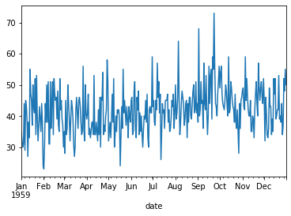
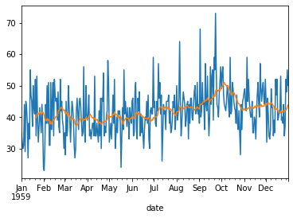
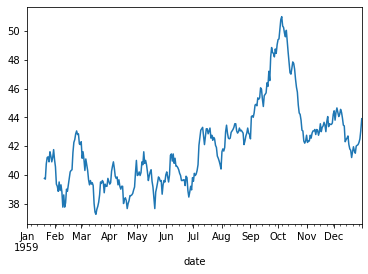
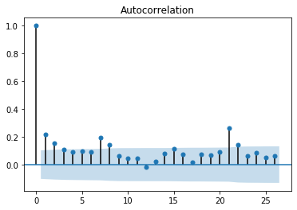
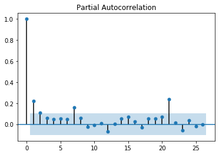

```python
import pandas as pd
import matplotlib.pyplot as plt
%matplotlib inline
```


```python
# df_birth = pd.read_csv('daily-total-female-births-CA.csv')
```


```python
# df_birth.tail()

# we change the index as date 
```


```python
#type(df_birth)
```


```python
df_birth = pd.read_csv('daily-total-female-births-CA.csv',index_col = [0], parse_dates = [0], squeeze = True)
df_birth.head()
```


    date
    1959-01-01    35
    1959-01-02    32
    1959-01-03    30
    1959-01-04    31
    1959-01-05    44
    Name: births, dtype: int64


```python
type(df_birth)
```


    pandas.core.series.Series


```python
df_birth.size
```


    365


```python
df_birth.describe()
```


    count    365.000000
    mean      41.980822
    std        7.348257
    min       23.000000
    25%       37.000000
    50%       42.000000
    75%       46.000000
    max       73.000000
    Name: births, dtype: float64


```python
df_birth.plot()
```


    <matplotlib.axes._subplots.AxesSubplot at 0x7f9313065950>





```python
# doing smoothing : taking out some values like we need five valuies moving avg
# rolling help to remove the values and window parameter take 0 to 19 values

df_birth_MA = df_birth.rolling(window = 20).mean()
```


```python
df_birth.plot()
df_birth_MA.plot()
```


    <matplotlib.axes._subplots.AxesSubplot at 0x7f93133535d0>





```python
df_birth_MA.plot()
```


    <matplotlib.axes._subplots.AxesSubplot at 0x7f93134d2ed0>





```python


df_baseline_model = pd.concat([df_birth,df_birth.shift(1)], axis = 1)
df_baseline_model.head()
```


<div>
<style scoped>
    .dataframe tbody tr th:only-of-type {
        vertical-align: middle;
    }

    .dataframe tbody tr th {
        vertical-align: top;
    }

    .dataframe thead th {
        text-align: right;
    }
</style>
<table border="1" class="dataframe">
  <thead>
    <tr style="text-align: right;">
      <th></th>
      <th>births</th>
      <th>births</th>
    </tr>
    <tr>
      <th>date</th>
      <th></th>
      <th></th>
    </tr>
  </thead>
  <tbody>
    <tr>
      <td>1959-01-01</td>
      <td>35</td>
      <td>NaN</td>
    </tr>
    <tr>
      <td>1959-01-02</td>
      <td>32</td>
      <td>35.0</td>
    </tr>
    <tr>
      <td>1959-01-03</td>
      <td>30</td>
      <td>32.0</td>
    </tr>
    <tr>
      <td>1959-01-04</td>
      <td>31</td>
      <td>30.0</td>
    </tr>
    <tr>
      <td>1959-01-05</td>
      <td>44</td>
      <td>31.0</td>
    </tr>
  </tbody>
</table>
</div>


```python
type(df_baseline_model)
```


    pandas.core.frame.DataFrame


```python
df_baseline_model.columns
```


    Index(['births', 'births'], dtype='object')


```python
df_baseline_model.columns = ['Original', 'Predicted']
```


```python
df_baseline_model.head()
```


<div>
<style scoped>
    .dataframe tbody tr th:only-of-type {
        vertical-align: middle;
    }

    .dataframe tbody tr th {
        vertical-align: top;
    }

    .dataframe thead th {
        text-align: right;
    }
</style>
<table border="1" class="dataframe">
  <thead>
    <tr style="text-align: right;">
      <th></th>
      <th>Original</th>
      <th>Predicted</th>
    </tr>
    <tr>
      <th>date</th>
      <th></th>
      <th></th>
    </tr>
  </thead>
  <tbody>
    <tr>
      <td>1959-01-01</td>
      <td>35</td>
      <td>NaN</td>
    </tr>
    <tr>
      <td>1959-01-02</td>
      <td>32</td>
      <td>35.0</td>
    </tr>
    <tr>
      <td>1959-01-03</td>
      <td>30</td>
      <td>32.0</td>
    </tr>
    <tr>
      <td>1959-01-04</td>
      <td>31</td>
      <td>30.0</td>
    </tr>
    <tr>
      <td>1959-01-05</td>
      <td>44</td>
      <td>31.0</td>
    </tr>
  </tbody>
</table>
</div>


```python
df_baseline_model.dropna(inplace = True)

```


```python
df_baseline_model.head()
```


<div>
<style scoped>
    .dataframe tbody tr th:only-of-type {
        vertical-align: middle;
    }

    .dataframe tbody tr th {
        vertical-align: top;
    }

    .dataframe thead th {
        text-align: right;
    }
</style>
<table border="1" class="dataframe">
  <thead>
    <tr style="text-align: right;">
      <th></th>
      <th>Original</th>
      <th>Predicted</th>
    </tr>
    <tr>
      <th>date</th>
      <th></th>
      <th></th>
    </tr>
  </thead>
  <tbody>
    <tr>
      <td>1959-01-02</td>
      <td>32</td>
      <td>35.0</td>
    </tr>
    <tr>
      <td>1959-01-03</td>
      <td>30</td>
      <td>32.0</td>
    </tr>
    <tr>
      <td>1959-01-04</td>
      <td>31</td>
      <td>30.0</td>
    </tr>
    <tr>
      <td>1959-01-05</td>
      <td>44</td>
      <td>31.0</td>
    </tr>
    <tr>
      <td>1959-01-06</td>
      <td>29</td>
      <td>44.0</td>
    </tr>
  </tbody>
</table>
</div>


```python
from sklearn.metrics import mean_squared_error
import numpy as np
```


```python
mse_error = mean_squared_error(df_baseline_model.Original, df_baseline_model.Predicted)
```


```python
np.sqrt(mse_error)
```


    9.177283229394606


```python
# ARIMA - AutoRegressive (p) integrated (d) moving average (q)
```


```python
from statsmodels.graphics.tsaplots import plot_acf,plot_pacf

# plot_acf is refer to q
# ARIMA (p,d,q)

plot_acf(df_birth)
```





```python
# acf = 2 or 3 (q)
```


```python
plot_pacf(df_birth)
```





```python
# pacf = 1 or 2 (p)
```


```python
df_birth.size
```


    365


```python
birth_train = df_birth[0:330]
birth_test = df_birth[330:365]
```


```python
from statsmodels.tsa.arima_model import ARIMA

birth_ARIMA_model = ARIMA(birth_train, order = (3,1,3))
```


```python
import warnings
warnings.filterwarnings('ignore')
```


```python
birth_ARIMA_fit = birth_ARIMA_model.fit()
```


```python
birth_forecast = birth_ARIMA_fit.forecast(steps = 35)[0]
birth_forecast
```


    array([44.59900773, 44.34190316, 44.89769146, 45.60880938, 45.93466286,
           45.64507361, 44.97705739, 44.45193864, 44.47994425, 45.05118441,
           45.7457157 , 46.05311216, 45.75837061, 45.10240093, 44.5973328 ,
           44.63820686, 45.20546269, 45.88226902, 46.1716663 , 45.87224151,
           45.22835783, 44.74291695, 44.7960953 , 45.35908861, 46.01838602,
           46.29032821, 45.98667955, 45.35491024, 44.88867521, 44.95360761,
           45.51207553, 46.15408517, 46.40910752, 46.1016783 , 45.48204061])


```python
birth_test.head()
```


    date
    1959-11-27    51
    1959-11-28    46
    1959-11-29    44
    1959-11-30    52
    1959-12-01    45
    Name: births, dtype: int64


```python
np.sqrt(mean_squared_error(birth_test,birth_forecast))
```


    6.7226659159715325


```python

```
